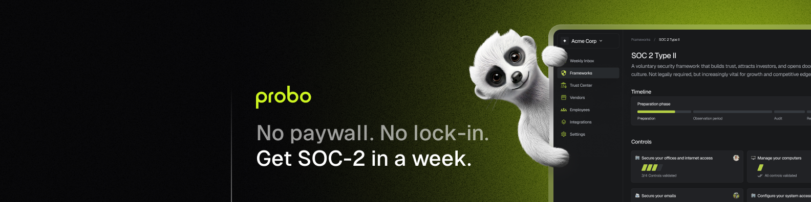

<div align="center">
<h1>Probo - Open Source Compliance</h1>



[](https://discord.gg/8qfdJYfvpY)
[](LICENSE)


</div>

Probo is an open-source compliance platform built for startups that helps you
achieve SOC-2 compliance quickly and efficiently. Unlike traditional solutions,
Probo is designed to be accessible, transparent, and community-driven.

## ✨ Features

- 💡 **Focus on relevance**

  - Tailored program: only what matters, so you get SOC-2 ready in just 20
    hours.
  - Context-aware security controls.
  - Smart task prioritization based on your risk profile.

- ⚡️ **Smart automation**

  - Automated risk assessment.
  - AI-powered policy generation tailored to your stack.
  - Pre-filled vendor risk assessment.

- 🔓 **No Vendor Lock-in**

  - Own your compliance data.
  - Export everything, anytime.
  - Open-source transparency.

- 💰 **Cost-Effective**
  - Free to use.
  - Pay for the services you need only.
  - No hidden fees or forced costs.

## 🚀 Getting Started

### Prerequisites

- Go 1.21+
- Node.js 22+
- Docker

### Quick Start

1. Clone the repository:

   ```bash
   git clone https://github.com/getprobo/probo.git
   cd probo
   ```

2. Install dependencies:

   ```bash
   # Install Go dependencies
   go mod download

   # Install Node.js dependencies
   npm ci
   ```

3. Start the development environment:

   ```bash
   # Start infrastructure services
   make stack-up

   # Build the project
   make build

   # Start the application
   bin/probod
   ```

The application will be available at:

- Frontend: http://localhost:3000
- API: http://localhost:8080
- Grafana: http://localhost:3001

For detailed setup instructions, see our [Contributing Guide](CONTRIBUTING.md).

## 🏗️ Current Status

Probo is in early development, focusing on building a solid foundation for
compliance management. Here's our current focus:

### Under Development (V0)

- 🎯 **Core Compliance Engine**

  - SOC 2 control framework implementation
  - Basic policy management
  - Evidence collection system
  - User and organization management

- 📋 **Essential Features**
  - Control tracking and status
  - Basic task management
  - Simple evidence attachments
  - Team collaboration tools

## 🛠️ Tech Stack

### Backend

- [Go](https://go.dev/) - API server
- [PostgreSQL](https://www.postgresql.org/) - Data storage
- [GraphQL](https://graphql.org/) - API layer

### Frontend

- [React](https://react.dev/) with [TypeScript](https://www.typescriptlang.org/)
- [Relay](https://relay.dev/) - Data fetching
- [TailwindCSS](https://tailwindcss.com/) - Styling

### Infrastructure

- [Docker](https://www.docker.com/) - Containerization
- [OpenTelemetry](https://opentelemetry.io/) - Observability
- [GitHub Actions](https://github.com/features/actions) - CI/CD

### Observability

- Grafana - Metrics visualization
- Prometheus - Metrics collection
- Loki - Log aggregation
- Tempo - Distributed tracing

## 🤝 Contributing

We love contributions from our community! There are many ways to contribute:

- 🌟 Star the repository to show your support
- 🐛 [Report bugs](https://github.com/getprobo/probo/issues/new)
- 💡 [Request features](https://github.com/getprobo/probo/issues/new)
- 🔧 Submit pull requests
- 📖 Improve documentation

Please read our [Contributing Guide](CONTRIBUTING.md) before making a pull
request.

## 🌟 Why Probo?

1. **Accessible Compliance**: Traditional solutions are often behind expensive
   paywalls. We believe security measures should be accessible to all.

2. **Fresh Approach**: Built from scratch, learning from past issues to create a
   better compliance experience.

3. **Community-Driven**: As an open-source project, we believe the entire
   ecosystem should benefit from improvements and innovations.

## 📚 Documentation

- 📖 [Official Documentation](coming soon)
- 💬 [Discord Community](https://discord.gg/8qfdJYfvpY)
- 📝 [Blog](https://www.getprobo.com/blog)

## 🌐 Community & Support

- Join our [Discord community](https://discord.gg/8qfdJYfvpY)
- Follow us on [Twitter](https://twitter.com/getprobo)
- Connect on [LinkedIn](https://www.linkedin.com/company/getprobo)
- Visit our [website](https://www.getprobo.com)

## 📄 License

Probo is [MIT licensed](LICENSE).
