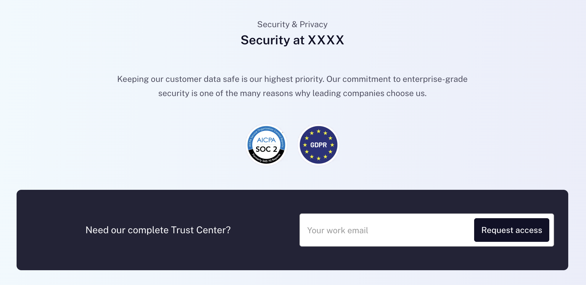

# Have a security page

## Purpose

Having SOC-2 for yourself is useless, you want to leverage it as much as
possible.

## Implementation

Something simple!

People need to know how to contact you if there is an incident or want access to
your trust center.

## Evidence

- Link to your security page
